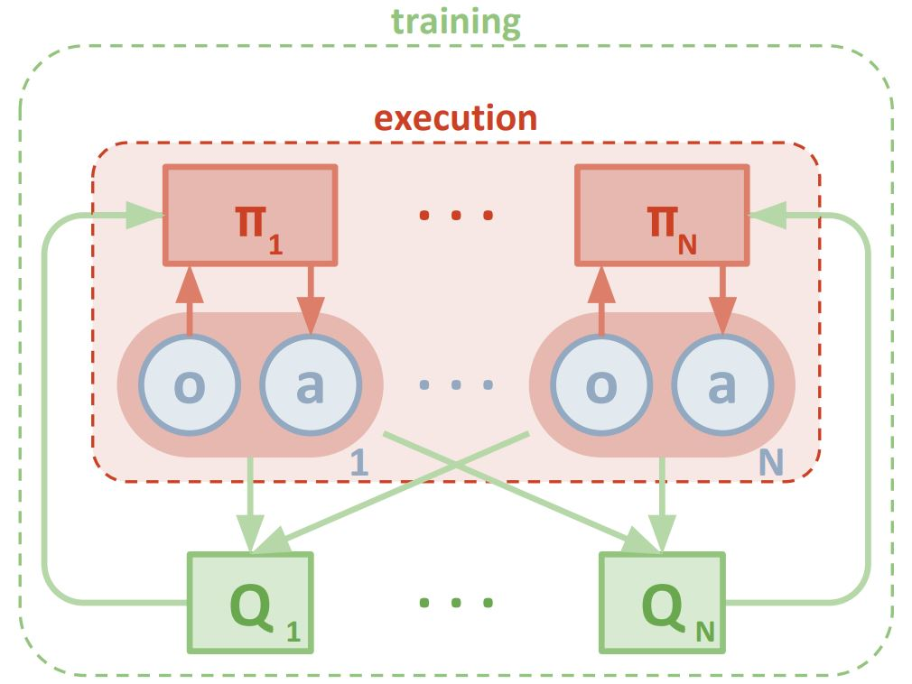
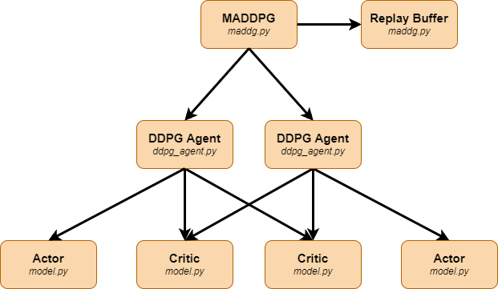

[//]: # (Image References)

[image1]: img/untrained-gif.gif "Untrained Agent"
[image2]: img/trained-gif.gif "Trained Agent"
[image3]: img/first-score.png "First Score"
[image4]: img/maddpg.JPG "Multi-agent decentralized actor, centralized critic"
[image5]: img/maddpg-algo.png "MADDPG Pseudo-Code"
[image6]: img/final-score.png "Final Score"

# Project Report: Collaboration and Competition

## The Environment

For this project, you will work with the [Tennis](https://github.com/Unity-Technologies/ml-agents/blob/master/docs/Learning-Environment-Examples.md#tennis) environment.

![Untrained Agent][image1]

In this environment, two agents control rackets to bounce a ball over a net. If an agent hits the ball over the net, it receives a reward of +0.1.  If an agent lets a ball hit the ground or hits the ball out of bounds, it receives a reward of -0.01.  Thus, the goal of each agent is to keep the ball in play.

The observation space consists of 8 variables corresponding to the position and velocity of the ball and racket. Each agent receives its own, local observation.  Two continuous actions are available, corresponding to movement toward (or away from) the net, and jumping. 

The task is episodic, and in order to solve the environment, your agents must get an average score of +0.5 (over 100 consecutive episodes, after taking the maximum over both agents). Specifically,

- After each episode, we add up the rewards that each agent received (without discounting), to get a score for each agent. This yields 2 (potentially different) scores. We then take the maximum of these 2 scores.
- This yields a single **score** for each episode.

The environment is considered solved, when the average (over 100 episodes) of those **scores** is at least +0.5.

## Solution - Multi-Agent DDPG

Following the Multi-Agent Actor Critic approach presented [here](https://proceedings.neurips.cc/paper/2017/file/68a9750337a418a86fe06c1991a1d64c-Paper.pdf), each racket is represented by an individual actor network. While each actor only samples from own experiences, the central critic samples from the shared experiences of both agents.

The actor and critic networks consist of a fully-connected hidden layer followed by a batch normilization and two fully-connected hidden layers with relu activation:  

<table>
<tr><th>Actor Layout </th><th>Critic Layout</th></tr>
<tr><td>

| Layer | Size | 
| ------------- | ------------- | 
| Input  | 24  | 
| 1st Hidden Layer  | 24x400  | 
| 2nd Hidden Layer  |400x300  | 
| 3rd Hidden Layer  | 300x2 | 
| Output  | 2  |

</td><td>

| Layer | Size |
| ------------- | ------------- | 
| Input  | 52 | 
| 1st Hidden Layer  | 52x400  | 
| 2nd Hidden Layer  | 400x300  | 
| 3rd Hidden Layer  | 300x1 | 
| Output  | 1  |  

</td></tr> </table>

### Results 
At first, training turned out to be very slow. Only after ~2000 episodes the average score began to increase until it eventually started alternating around an average reward of **`0.35`** (see figure below). The following modifications helped the agents to converge faster and achieve higher average scores:
- decreasing the batch size from **`1024`** down to **`256`**
- updating only every **`7`** episodes
- updating multiple (**`5`**) times per episode
- adding noise decay (**`0.995`**)
- adding batch normalization to both the actor and critic network
- using ReLU activation (instead of leaky ReLU)

Finally (and after several attempts), the environment was solved after **`1424`** episodes with an average score of **`+0.50`** over the last 100 episodes. The best result was achieved after **`1875`** episodes with an average score of **`+1.92`**.

<table>
<tr><th>First Attempt</th><th>Final Result</th></tr>
<tr><td>
  
![First Attempt][image3]

</td><td>
  
![Final Score][image6]
  
</td></tr> </table>

Using the trained networks, the agents were able to cooperate and reliably kept the ball above the ground.   

![Trained Agent][image2]

### Hyperparameters

| Parameter | Value |
| ------------- | ------------- |
| BUFFER_SIZE  | 1e6  |
| BATCH_SIZE  | 256  |
| GAMMA  | 0.99  |
| TAU  | 1e-3  |
| LR_ACTOR  | 1e-4  |
| LR_CRITIC  | 3e-4  |
| WEIGHT_DECAY  | 0  |
| NOISE_DECAY  | 0.995  |
| MU  | 0  |
| THETA  | 0.15  |
| SIGMA  | 0.2  |

## Future Work
In order to further speed up the learning rate we could use priority experience replay. A priority buffer, in addition to the agents' experiences, maintains a sampling probability for ech experience in the buffer which is proportional to its respective training loss (expected result vs actual result). The higher the sampling probability, the greater the chance that an experience is sampled which makes the network learn a lot. 

## Appendix
### Class Diagram

